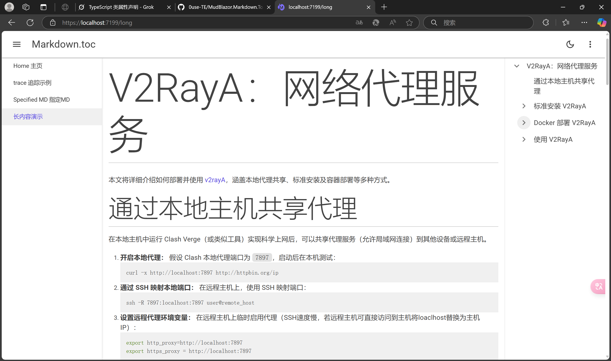

#### Language
- [🇨🇳 中文](./ReadMe/ReadMe.cn.md)  

- ## MudBlazor.Markdown.Toc

### Introduction

Hello, I am Ouse. This is an extension tool based on MudBlazor.Markdown for generating a table of contents (TOC). It supports the following features:

1. Customizing the style of the TOC
2. Specifying the corresponding MudMarkdown component for the generated TOC
3. Automatically scrolling to the corresponding element
4. Automatically tracking the TOC when the content changes

### Demonstration



You can clone the repository locally, start the sample project, and experience it!

### Basic Usage

1. Complete the configuration of MudBlazor and MudBlazor.Markdown.

2. Install Package

   ```shell
   NuGet\Install-Package MudMarkdown.Toc -Version 1.0.1
   ```

   NuGet URL:[NuGet Gallery | MudMarkdown.Toc 1.0.1](https://www.nuget.org/packages/MudMarkdown.Toc/#readme-body-tab)

3. Depending on the Blazor project type, import the corresponding file. For Blazor Web App, import it into App.razor; for standalone Blazor Wasm, import it into index.html:

   ```html
    <script src=@Assets["_content/MudBlazor.Markdown.Toc/Markdown.Toc.js"] type="module"></script>
   ```

4. Import the namespace:

   ```csharp
   @using MudBlazor.Markdown.Toc
   ```

5. Use the MudMarkdownToc component. You can place this component anywhere, here it is placed inside a MudDrawer. If your page has only one MudMarkdown component and the content does not change (users do not modify the Value parameter on this page), you can directly use this component. For other requirements, check the API section.

   ```html
   //The componment of MudMarkdown must before in the componment of MudMarkdownToc
   //Because the componment of MudMarkdown should render before the MudMakrdownToc
   <MudMarkdown Value="@value"/>
   <MudDrawer Open Fixed Anchor="Anchor.Right" ClipMode="DrawerClipMode.Always">
   <MudMarkdownToc></MudMarkdownToc>
   </MudDrawer>
   ```

### API

The MudMarkdownToc component internally uses the MudTreeView component, so it inherits most properties of MudTreeView. Below are the unique properties of MudMarkdownToc 😋


- **Id**: Specifies which MudMarkdown component the TOC is generated for. Since the MudMarkdown component cannot have an Id, you need to add another HTML tag outside. For example, the TOC will be generated only for the element with the Id "one":

```html
<MudGrid>
    <MudItem xs="6">
<MudMarkdown Value="@value" />
    </MudItem>
    <MudItem xs="6">
        <div id="one">
<MudMarkdown Value="@value1" />
        </div>
    </MudItem>
</MudGrid>
<MudDrawer Open Fixed Anchor="Anchor.Right" ClipMode="DrawerClipMode.Always">
    <MudMarkdownToc Id="one"></MudMarkdownToc>
</MudDrawer>
```

- **MonitoredValue**: If your Value property content changes, use this property to monitor the passed content and compare it. If the parameter changes, the TOC will be regenerated. Without this property, switching content will not update the TOC!

```html
<MudMarkdown Value="@currentValue" />
<MudDrawer Open Fixed Anchor="Anchor.Right" ClipMode="DrawerClipMode.Always">
    @* Add the content to be monitored *@
    <MudMarkdownToc MonitoredValue="@currentValue"></MudMarkdownToc>
    <MudButton OnClick="SwitchContent">SwitchContent</MudButton>
</MudDrawer>
```

### End

A big thank you to the contributors of MudBlazor and MudBlazor.Markdown!

If you have any questions, please contact me or open an Issue!

This is my first NuGet package, and I hope it helps your project. If you like it, consider giving it a Star and a Follow. I will continue to create new tools for the .NET community ❤❤❤.

