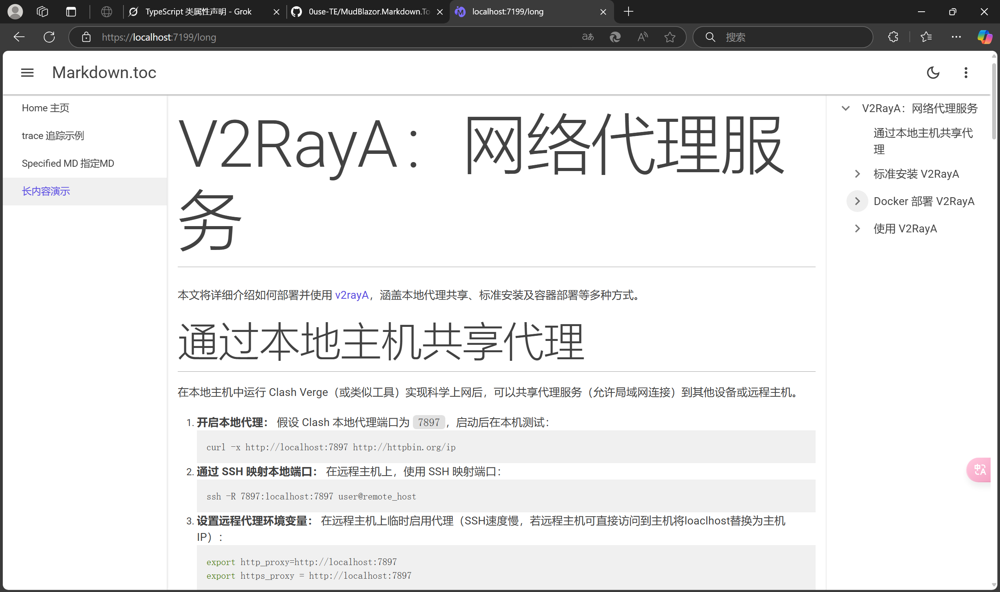
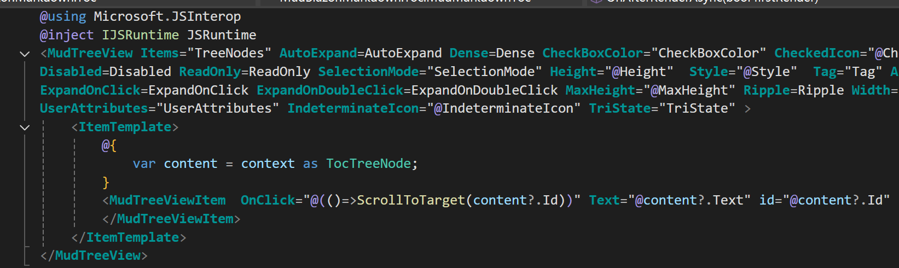

##                    MudBlazor.Markdown.Toc

### 简介

您好，我是Ouse，这是一个基于MudBlazor.Markdown的拓展工具，用于生成目录，它支持以下功能：

1. 自定义目录的样式
2. 指定生成的目录对应的MudMarkdown组件
3. 自动滑动到对应的元素
4. 内容变化后，目录可以自动跟踪

### 展示



您可以clone仓库到本地，启动样例项目，体验一下！

### 基础使用

1. 先完成MudBlazor和MudBlazor.Markdown的配置。

2. 引用nuget包，即将添加Nuget包(由于MudBlazor的前缀导致包要等几天才能上传)，您现在可以前往发布页面，下载后导入自己的项目，或者下载项目后自己打包。

3. 根据blazor项目不同引入到对用的文件，Blazor Web App引入到App.razor,Blazor 独立 Wasm引入到index.html

   ```html
    <script src=@Assets["_content/MudBlazor.Markdown.Toc/Markdown.Toc.js"] type="module"></scrip>
   ```

4. 引入命名空间

   ```css
   @using MudBlazor.Markdown.Toc
   ```

5. 使用MudMarkToc组件，您可以将该组件放在任意位置，这里放在了MudDrawer里面，如果您的页面只有一个MudMarkdown组件，并且内容不会更改(用户在该页面后，不会修改Value参数)，您可以直接使用该组件，如果有前面说的需求，您可以查看Api部分

   ```html
   <MudMarkdown Value="@value"/>
   <MudDrawer Open  Fixed Anchor="Anchor.Right" ClipMode="DrawerClipMode.Always">
   <MudMarkdownToc></MudMarkdownToc>
   </MudDrawer>
   ```

### Api

MudMarkdownToc组件内部使用的是MudTreeView组件，因此它包含了MudTreeView的大多数属性，下面只讲解它特有的属性😋



Id:执行MudMarkdownToc组件为哪个MudMarkdown组件生成目录，由于MudMarkdown组件无法添加Id，您需要在外面添加其他html标签，如下所示，现在只会为id为one的元素生成目录。

```html
<MudGrid>
    <MudItem xs="6">
<MudMarkdown Value="@value" />
    </MudItem>
    <MudItem xs="6">
        <div id="one">
<MudMarkdown Value="@value1" />
        </div>
    </MudItem>
</MudGrid>
<MudDrawer Open Fixed Anchor="Anchor.Right" ClipMode="DrawerClipMode.Always">
    <MudMarkdownToc Id="one"></MudMarkdownToc>
</MudDrawer>
```

MonitoredValue:如果您的Value属性内容会发送改变，请使用添加这个属性，他会监测传入的内容并进行比较，如果参数发生改变，他会重新生成目录，如下所示，如果不添加该属性，切换内容后，目录将不会改变！

```html
<MudMarkdown Value="@currentValue"  />
<MudDrawer Open Fixed Anchor="Anchor.Right" ClipMode="DrawerClipMode.Always">
      @* 添加要追踪的内容变化 *@
    <MudMarkdownToc MonitoredValue="@currentValue"></MudMarkdownToc>
    <MudButton OnClick="SwitchContent">SwitchContent 切换内容</MudButton>
</MudDrawer>
```

### 结束

非常感谢MudBlazor和MudBlazor.Markdown这两个项目的贡献者。

如果有问题，请联系我或者打开一个Issue！

这是我的第一个nuget包，希望能对您的项目有所帮助，如果您喜欢的话，不妨Star和Follow一下，我会不断为Dotnet社区做出新工具❤❤❤。